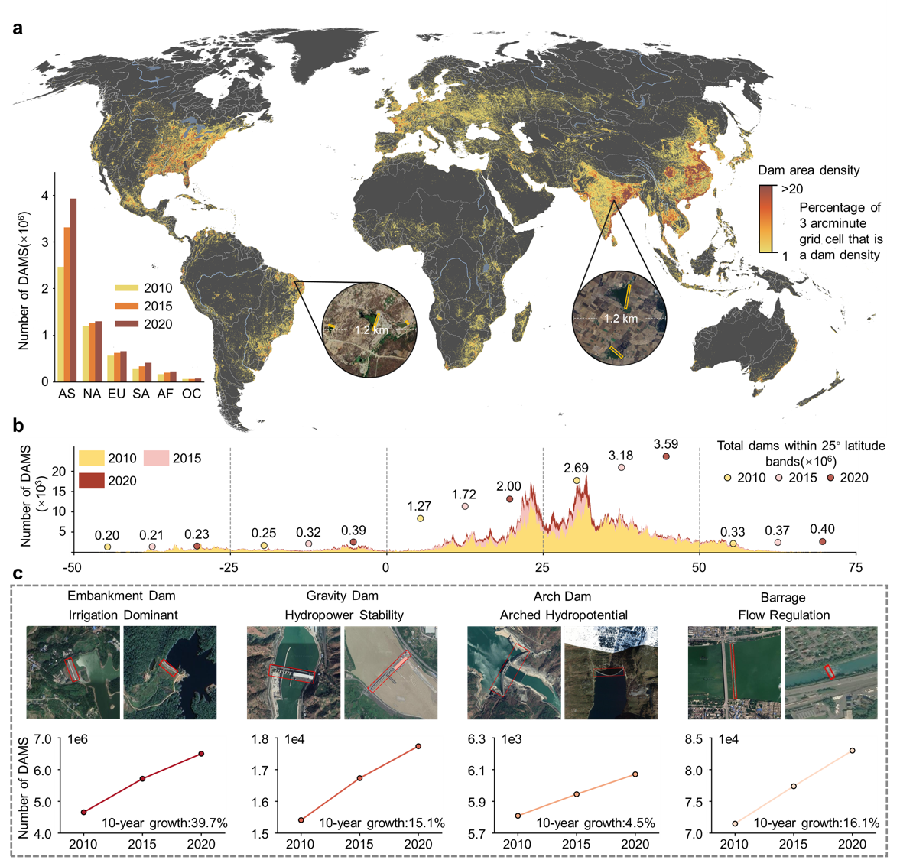

# **A Significant but Uneven Increase in Global Dams over the Recent Decade**

This repository contains the code implementation for our research on global dam distribution and dynamics mapping using deep learning and satellite imagery analysis.

## Overview

We present a comprehensive analysis of global dam proliferation from 2010 to 2020, revealing a 39.2% increase in dam numbers worldwide. Our study leverages deep learning to interpret high-resolution satellite imagery, providing unprecedented insights into dam distribution patterns and their ecological impacts.




## Repository Structure

```
├── result1/          # Multi-Temporal Multi-Class Mapping of Global Dams
├── result2/          # Policy and Socio-Economic Impacts on Global Dam Change
├── result3/          # Global Dam Change's Riverine Ecological Consequences
├── tools/            # Multi-temporal annotation tools
└── doc/             # Documentation and figures
```

## Code Organization

### Result 1: Multi-Temporal Multi-Class Mapping of Global Dams(coming soon)

Contains code for:

- HDD-Net deep learning model implementation
- Global dam detection and classification
- Multi-temporal change analysis (2010, 2015, 2020)

### Result 2: Policy and Socio-Economic Impacts on Global Dam Change(coming soon)

Contains code for:

- Regional dam growth analysis
- Policy impact assessment
- Socio-economic  impact analysis

### Result 3: Global Dam Change's Riverine Ecological Consequences

Contains code for:

- River fragmentation index calculation
- Hydrological connectivity analysis

### Tools: Multi-temporal Annotation Tools

Contains:

- Custom annotation interface for dam labeling
- Quality control and verification tools
- Multi-temporal consistency validation utilities

## Requirements

```
Python 3.8+
PyTorch 1.x
GDAL
Rasterio
GeoPandas
NumPy
Pandas
Scikit-learn
```

## Data Availability

The global dam inventory datasets for 2010, 2015, and 2020 are available upon request. Please contact the corresponding author for data access.

## License

This project is licensed under the MIT License - see the LICENSE file for details.

## Acknowledgments

We thank the expert annotation team and all contributors who made this global-scale analysis possible.
